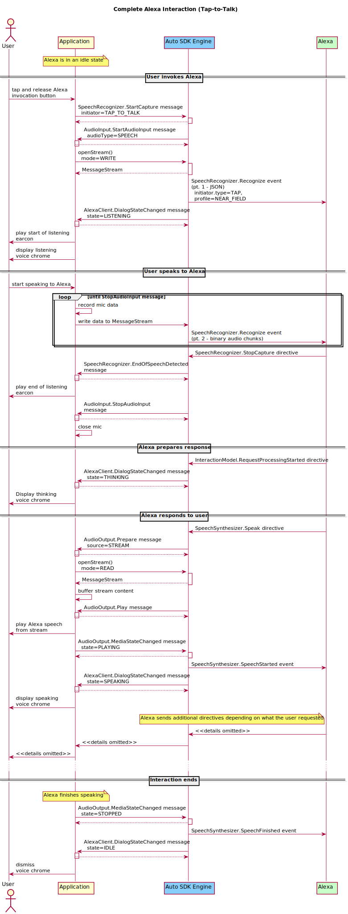

# AlexaClient Interface

## Render Alexa's attention state

Your application can subscribe to the `AlexaClient.DialogStateChanged` message to be notified what state Alexa dialog is in (e.g., Alexa started listening to the user's speech or started speaking her response). This message helps your application render Alexa's attention state UI such as Voice Chrome and audio cues without having to derive these states by tracking your application's microphone and media player.

The following diagram shows how you might use the dialog state changes to provide Alexa attention feedback during an interaction.

Click to expand or collapse sequence diagram: Alexa invocation

 

## Monitor Alexa's connection status

Your application can subscribe to the `AlexaClient.ConnectionStatusChanged` message to be notified when the status of the Engine's connection to Alexa has changed (e.g., the Engine lost connection to Alexa). You might use this information, for instance, to enable or disable certain functionality or display information to the user.

## Monitor Alexa's authorization state

Your application can subscribe to the `AlexaClient.AuthStateChanged` message to be notified what state the Engine is in with respect to the user sign in. For example, the state is `REFRESHED` when the Engine has an access token.