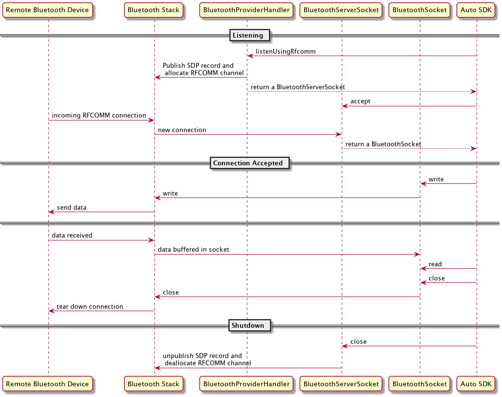

# Bluetooth Module

## Overview

The `Bluetooth` module allows the Alexa Auto SDK to connect to devices through the Bluetooth Classic or Bluetooth Low Energy (BLE) protocol. Using these protocols, the Auto SDK can offer Bluetooth-based features, such as Alexa Mobile Accessory (AMA) or Mobile Authorization, to users of Android or iOS smartphones.

## Requirements for Bluetooth Classic or BLE
The variant of the Bluetooth standard determines the tasks required to support the client.

### Bluetooth Classic
Complete the following tasks to support different clients:

* For Android phones, create a RFCOMM socket with the corresponding Service Discovery Protocol (SDP) record. (RFCOMM is a Bluetooth transport protocol.)
* For iOS phones, create an iOS Accessory Protocol 2 (iAP2) communication channel.

For information about these tasks, see [Supporting Bluetooth Classic](#supporting-bluetooth-classic-transport).

### BLE
Add a new Generic Attribute Profile (GATT) service and advertise the service. For information about this task, see [Supporting BLE](#supporting-ble-transport).

## Choosing a Transport Protocol

Consider the following factors when choosing the protocol to use with Bluetooth:

* Capabilities and limitations of remote devices (e.g., Android or iOS phones)
* Capabilities of the Bluetooth software stack, which includes the system service, driver, and firmware (e.g., whether the software supports RFCOMM or iAP2)
* Capabilities of the Bluetooth chipset used on the head unit (e.g., single-mode or dual-mode)

The following table shows the transport protocol to use based on the head unit chipset and the type of smartphone.

>**Note:** To use Bluetooth for Mobile Authorization, you must use RFCOMM as the transport protocol.

|                   | Single-mode chipset | Dual-mode chipset |
| ----------------- | --------------------- | ------------------- |
| **iOS phone**     | iAP2                  | iAP2 or GATT        |
| **Android phone** | RFCOMM                | RFCOMM or GATT      |

### Supporting Bluetooth Classic
Follow one of these steps, depending on the transport protocol, to create a communication channel between the head unit and the phone:

* For RFCOMM communication, assign an unused RFCOMM channel to the head unit to listen on. The implementation must register an SDP record with the local SDP server, which is part of the Bluetooth software stack. The server contains the specified UUID, service name, and auto-assigned channel. Remote Bluetooth devices can use the same UUID to query the SDP server and discover the channel to connect to.

    The SDP record is removed when the socket is closed or if the application closes unexpectedly. Android clients discover the head unit by using the method that is described in [BluetoothDevice.getUuids](https://developer.android.com/reference/android/bluetooth/BluetoothDevice#getUuids()).

* For iAP2, allocate a communication channel with the specified protocol identifier. For information about iAP2, see the Accessory Interface Specification for Apple Devices.

### Supporting BLE
In your implementation, create a new GATT service according to the JSON configuration specified in the `GATTServer.start` call. The following JSON shows a sample configuration:

```json
{
  "characteristics": [
    {
      "id": "A49921F7-9E7D-46F6-8832-9F44658892AC",
      "mtu": 104,
      "name": "Alexa Characteristic TX",
      "permissions": [
        "write"
      ],
      "properties": [
        "write"
      ]
    },
    {
      "descriptors": [
        {
          "id": "00002902-0000-1000-8000-00805f9b34fb",
          "name": "Configuration",
          "permissions": [
            "read",
            "write"
          ]
        }
      ],
      "id": "34D7A574-5298-4C35-8109-1EAA2E9476E8",
      "mtu": 104,
      "name": "Alexa Characteristic RX",
      "permissions": [
        "read"
      ],
      "properties": [
        "notify",
        "read"
      ]
    }
  ]
}
```

## Using the Bluetooth Module

For Linux and QNX, register the following C++ platform interface with the Auto SDK:

> **Note**: The `Bluetooth` interface does not have AASB messages yet. Use the `BluetoothProvider` platform interface as described below.

```cpp
class BluetoothProvider : public aace::core::PlatformInterface {
    /**
     * Create a GATT Server.
     *
     * @return the created GATT server. nullptr if GATT is not supported.
     */
    virtual std::shared_ptr<GATTServer> createGATTServer();

    /**
     * Create an RFCOMM server socket and register the corresponding SDP record.
     *
     * @param name service name for SDP record
     * @param uuid uuid for SDP record
     * @return the created server socket. nullptr if any error occurs.
     */
    virtual std::shared_ptr<BluetoothServerSocket> listenUsingRfcomm(const std::string& name, const std::string& uuid);

    /**
     * Create an iAP2 server socket with specified protocol.
     *
     * @param protocol the protocol to use when communicating with the device
     * @return the created server socket. nullptr if any error occurs.
     */
    virtual std::shared_ptr<BluetoothServerSocket> listenUsingiAP2(const std::string& protocol);
};
```

>**Note:** Amazon does not provide reference implementation for Linux and QNX.

## Sequence Diagrams
The sequence diagrams illustrate the flow for a Bluetooth Classic connection and the flow for a BLE connection.

### Bluetooth Classic Connection


### BLE Connection


## Requirement for Accepting Connections from Another Device
The Alexa app hosting either the GATT service or RFCOMM server socket must run in the background to accept connections from another device.