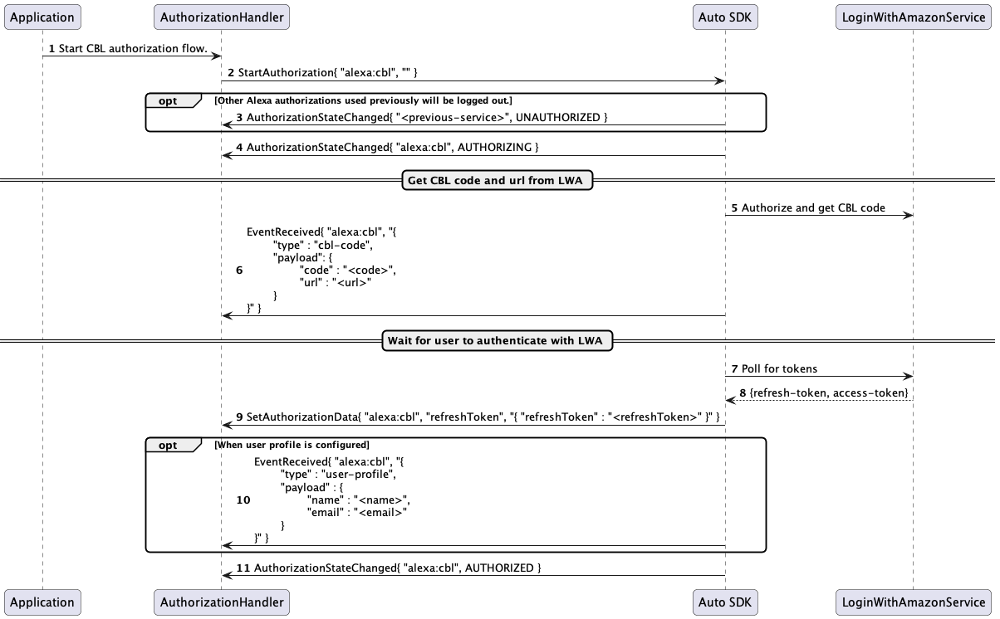
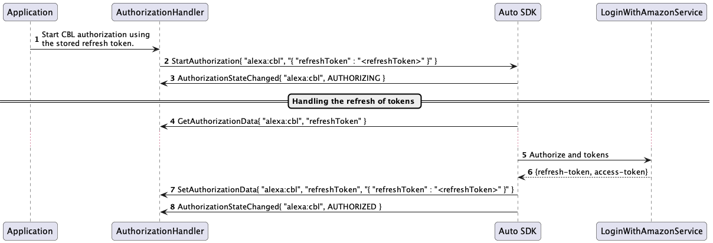

# Code-Based Linking (CBL) Module

## Overview

Every request to Alexa Voice Service (AVS) requires a Login with Amazon (LWA) access token. The Alexa Auto SDK CBL module implements the [CBL mechanism](https://developer.amazon.com/en-US/docs/alexa/alexa-voice-service/authorize-cbl.html) of acquiring such tokens.
Use the `Authorization` AASB message interface to start, cancel, and log out of CBL authorization. For more information about how the Engine manages authorization, see the [`Authorization`](https://alexa.github.io/alexa-auto-sdk/docs/explore/features/core/Authorization/) interface documentation.


Note that we use the following JSON-like notation to describe an AASB message:

```aasb
Action {
    field: value,
    ...
}
```

## Integrate the Authorization interface for CBL

To use the Engine's implementation of CBL for for fetching and refreshing Alexa access tokens, use the `Authorization` interface according to the following specification. Use `"alexa:cbl"` for the service parameter in `Authorization` messages.

### Start the authorization flow

Use the `Authorization.StartAuthorization` message to start authorization on every Engine start.
The `data` field in the message payload has the following JSON structure:

~~~json
{
    "refreshToken":"{STRING}"
}
~~~

If the user is not signed in to their Amazon account, use an empty string as the data parameter. For example,

~~~cpp
    StartAuthorizationMessage msg;
    msg.payload.service = "alexa:cbl";
    msg.payload.data = "";
    m_messageBroker->publish(msg);
~~~

The Engine uses the absence of refresh token in the message to trigger the [code pair request](https://developer.amazon.com/en-US/docs/alexa/alexa-voice-service/authorize-cbl.html#step2) that fetches a URL and one-time code to display to the user.

If the user has already signed in on a previous Engine cycle, the application should already have a stored refresh token. Include the refresh token in the `SetAuthorizationData` message using the key `"refreshToken"`. For example,

~~~cpp
    StartAuthorizationMessage msg;
    msg.payload.service = "alexa:cbl";
    msg.payload.data = "{"refreshToken":“Atzr|IQEBLzAtAhRP”}";
    m_messageBroker->publish(msg);
~~~

The Engine uses the presence of the refresh token in the message to [request a new access token](https://developer.amazon.com/en-US/docs/alexa/alexa-voice-service/authorize-cbl.html#step5) for the user without requiring the user to complete any steps.

### Receive data from the Engine

This section describes the protocol for getting the code pair and user profile data by using the `EventReceived` message.

After `StartAuthorization` in the sign-in flow, the Engine publishes an `EventReceived` message including the URL and one-time code pair. The `event` parameter in the message payload is a serialized JSON string with the following structure:

~~~json
{
    "type": "cbl-code",
    "payload": {
        "code": "{STRING}",
        "url": "{STRING}"
    }
}
~~~

The following `EventReceived` message example provides the application with a CBL code and URL:

~~~aasb
EventReceived {
    service: "alexa:cbl",
    event: "{\"type\":\"cbl-code\", \"payload\":{\"code\":\"OC2EFA\",\"url\":\"some-url\"}}"
}
~~~

Your application should display the URL and code to the user as text or a QR code following the [Alexa Auto Design Guidelines](https://developer.amazon.com/en-US/docs/alexa/alexa-auto/setup.html#sign-in).

If your application configured the Engine to enable CBL user profile data, the Engine's request to Login with Amazon will include user email and name in the request scope. After the user has signed in, the Engine will publish an `EventReceived` message. The `event` parameter in the message payload is a serialized JSON string with the following structure:

~~~json
{
    "type": "user-profile",
    "payload": {
        "name": "{STRING}",
        "email": "{STRING}"
    }
}
~~~

The following `EventReceived` message example provides the user profile data for an application to display the signed-in user's name and email:

~~~aasb
EventReceived {
    service: "alexa:cbl",
    event: "{\"type\":\"user-profile\",\"payload\":{\"name\":\"some-name\",\"email\":\"some-email\"}}"
}
~~~

### Store the refresh token

The Engine requires the application to securely store authorization data on the device when requested. Once the Engine fetches a refresh token during a new sign-in flow, the Engine will publish a `SetAuthorizationData` message that includes the token for your application to store.

The `data` parameter in the message payload is a serialized JSON string with the following structure:

~~~json
{
    "refreshToken": "{STRING}"
}
~~~

For example,

~~~aasb
SetAuthorizationData {
    service: "alexa:cbl",
    key: "refreshToken",
    data: "{\"refreshToken\":\"Atzr|IQEBLzAtAhRP\"}"
}
~~~

Your application must securely store the token and provide it any time the Engine requests the refresh token with a `GetAuthorizationData` message. The `key` parameter in the message payload is a serialized JSON string with the following structure:

~~~json
{
    "refreshToken":"{STRING}"
}
~~~

For example,

~~~aasb
GetAuthorizationData {
    service: "alexa:cbl",
    key: "refreshToken"
}
~~~

The application returns the refresh token in a reply message like the following example:

~~~aasb
GetAuthorizationDataReply {
    data: "{\"refreshToken\":\"Atzr|IQEBLzAtAhRP\"}"
}
~~~

### Cancel ongoing authorization

If the application needs to stop the CBL flow, for example, if the user cancels sign-in while the application is waiting for the user to sign in and enter the code, publish the  `CancelAuthorization` message. If the device is already authorized, the `CancelAuthorization` message cancels the token refreshing process. Canceling authorization does not affect the device authorization state.

### Sign out

Publish the `Logout` message if the user signs out of the application.

### Handle errors

This section describes the errors reported by the Engine.

The following list describes possible errors during authorization:

* `UNKNOWN_ERROR` is an unrecoverable error in the authorization process.
* `TIMEOUT` happens when the application's attempt to get the code pair from the LWA Service times out.
* `CODE_PAIR_EXPIRED` is caused by an expired code pair. The application must restart the authorization process and request a new code pair.
* `AUTHORIZATION_EXPIRED` is caused by an expired or a revoked refresh token.
* `LOGOUT_FAILED` happens when a logout attempt fails.
* `START_AUTHORIZATION_FAILED` happens when the authorization flow cannot start.

The Engine notifies the application about any error during authorization by publishing an `AuthorizationError` message. The following example shows how the Engine notifies the application when a code pair expires:

~~~aasb
AuthorizationError{service: "alexa:cbl", error: "CODE_PAIR_EXPIRED", message: ""}
~~~

## Enable user profile

If you want the Engine to provide information about the signed-in user to the application, include the following object in the Engine configuration file:

```json
{
    "aace.cbl": {
        "enableUserProfile": true
    }
}
```

Alternatively, you can generate the configuration programmatically by using the `createCBLUserProfileConfig` method:

```cpp
auto userProfileConfig = aace::cbl::config::CBLConfiguration::createCBLUserProfileConfig( true );
engine->configure( { //other config objects..., userProfileConfig, ... } );
```

The user profile is passed via the `eventReceived` API as described in [this section](#receiving-events-from-engine).

## Sequence Diagrams for CBL

The following diagram illustrates the flow when authorization starts.

Note that we use the following notation to represent an AASB message:

```aasb
Action{value, ...}
```



The following diagram illustrates how the Authorization platform interface handles a refresh token.



The following diagram illustrates the flow when authorization is canceled.


The following diagram illustrates the flow when the application logs out of the authorization.

