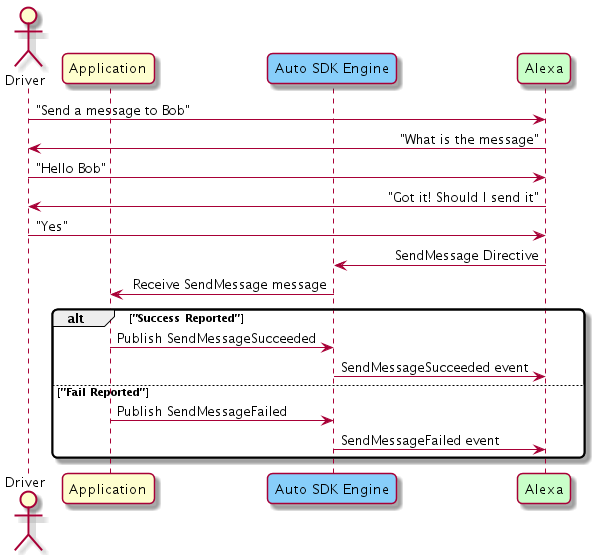
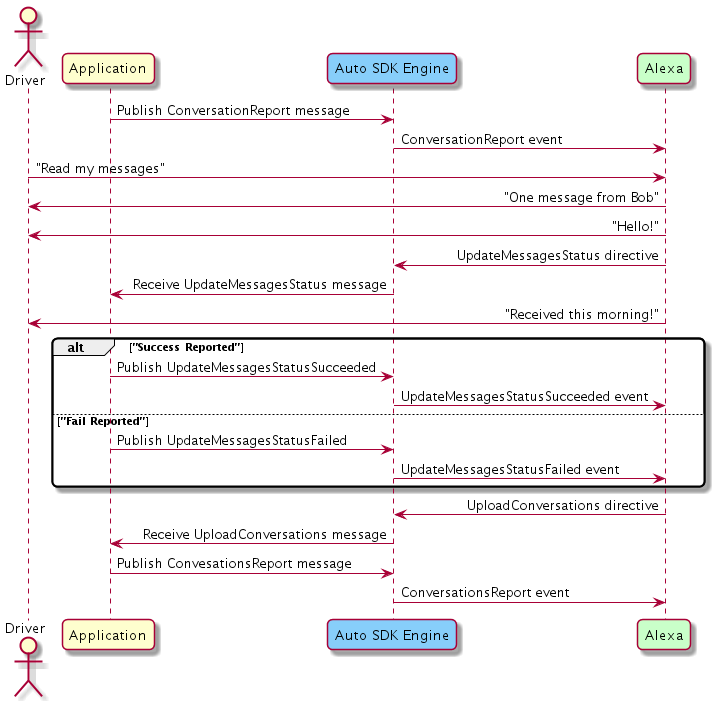
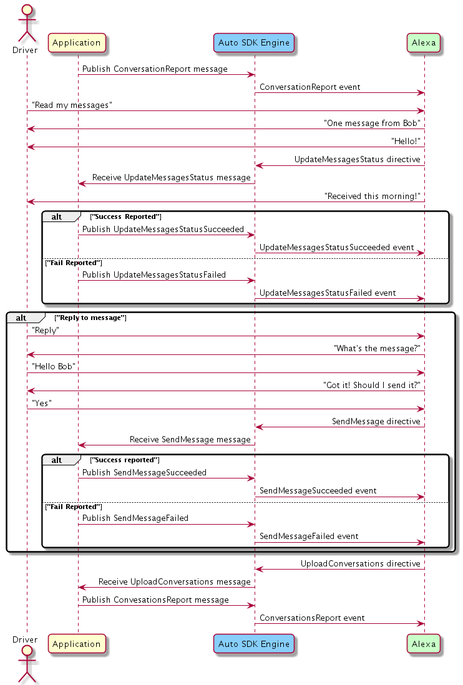
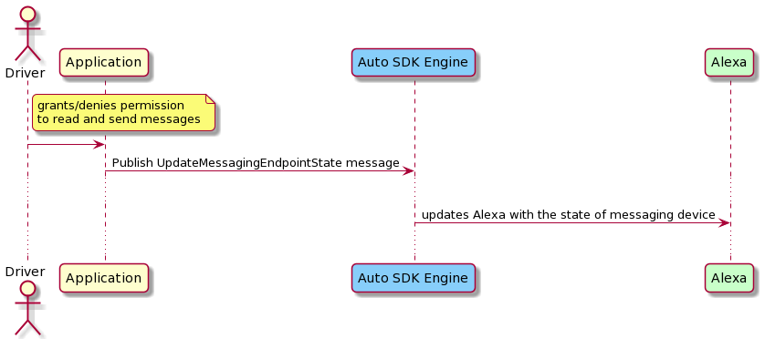

# Messaging Module

## Overview

The Alexa Auto SDK `Messaging` module enables your Alexa Auto SDK client application to use the Short Message Service (SMS) capabilities of Alexa, independent of the messaging device's connection mechanism. The SMS features of this module include reading messages, sending messages, and replying to messages as they are read.

The user must connect their device and consent to allow Alexa to read and send SMS messages through the messaging device. The Messaging feature can use phone numbers directly or use phone contacts uploaded via the `Address Book` module.


## Managing Messaging Sessions

The application is responsible for managing the life cycle of the messaging session, including enhancing the end user experience by:

* Uploading unread SMS messages when the messaging device is connected, so they are ready for readout.
* Uploading new SMS messages when they are received on the messaging device.
* Updating the status of messages when notified to do so.
* Responding to messaging requests with appropriate successful or failure responses.

Alexa will not notify the user when new SMS messages are available, your implementation is responsible for providing new message notifications.


## Configuring the Messaging Module

The `Messaging` module does not require Engine configuration.

## Using the Messaging Module AASB Messages

### Sending Messages

When Alexa sends a request to the Engine to deliver a message, the Engine publishes the [`SendMessage` message](https://alexa.github.io/alexa-auto-sdk/docs/aasb/messaging/Messaging/index.html#sendmessage) including the text and URL for the audio from which the message was created. Publish either the [`SendMessageSucceeded` message](https://alexa.github.io/alexa-auto-sdk/docs/aasb/messaging/Messaging/index.html#sendmessagesucceeded) or [`SendMessageFailed` message](https://alexa.github.io/alexa-auto-sdk/docs/aasb/messaging/Messaging/index.html#sendmessagefailed) indicating either the success or failure of the request.

<details markdown="1"><summary>Click to expand or collapse sequence diagram: Sending Messages</summary>
<br></br>


</details>
</br>

### Reading Messages

When a user requests for Alexa to read messages, your application's `Messaging` module integration must upload a conversation report containing all unread messages. Once Alexa requests a conversation report upload, the Engine publishes the [`UploadConversations` message](https://alexa.github.io/alexa-auto-sdk/docs/aasb/messaging/Messaging/index.html#uploadconversations). Publish the [`ConversationsReport` message](https://alexa.github.io/alexa-auto-sdk/docs/aasb/messaging/Messaging/index.html#conversationsreport) to notify the Engine to upload a conversation report to the cloud.

>**Note:** Messages are grouped by conversation, each given a unique identifier. Conversations also have unique identifiers and contain the list of recipient phone numbers included in the conversation, but not the phone number of the messaging device.

After Alexa reads a message, it notifies the application that the message was read and should exclude the read message in subsequent conversation report uploads. The Engine publishes the [`UpdateMessagesStatus` message](https://alexa.github.io/alexa-auto-sdk/docs/aasb/messaging/Messaging/index.html#updatemessagesstatus) to update the status of the SMS messages. Publish either the [`UpdateMessagesStatusSucceeded` message](https://alexa.github.io/alexa-auto-sdk/docs/aasb/messaging/Messaging/index.html#updatemessagesstatussucceeded) or [`UpdateMessageStatusFailed` message](https://alexa.github.io/alexa-auto-sdk/docs/aasb/messaging/Messaging/index.html#updatemessagesstatusfailed) indicating the success of the message status update. After Alexa reads all messages, or if message readout is interrupted, Alexa requests the upload of a new conversation report. In this way, Alexa stays in sync with unread messages on the messaging device.

>**Note:** Unread messages are stored in the cloud for 12 hours before being deleted. By design Alexa will read a limited number of unread messages with a 'read messages' utterance. Therefore, it may be necessary to issue additional read messages requests to head all messages.

<details markdown="1"><summary>Click to expand or collapse sequence diagram: Reading Messages and Replying</summary>
<br></br>


</details>
</br>

### Replying to Message

The user can request to reply to a message after Alexa reads the message or as it is being read. Replying is always done within the context of the currently read message.

<details markdown="1"><summary>Click to expand or collapse sequence diagram: Replying to Message</summary>
<br></br>


</details>
</br>

### Updating Messaging Endpoint State

When connection to a calling device is established or broken and/or the user grants or denies permissions to read and send messages, publish the [`UpdateMessagingEndpointState` message](https://alexa.github.io/alexa-auto-sdk/docs/aasb/messaging/Messaging/index.html#updatemessagingendpointstate) to update Alexa with the state of the messaging device.

<details markdown="1"><summary>Click to expand or collapse sequence diagram: Connecting/Disconnecting Calling Device</summary>
<br></br>


</details>

<details markdown="1"><summary>Click to expand or collapse sequence diagram: Granting/Denying Permissions to Read and Send Messages</summary>
<br></br>


</details>
</br>


## Integrating the Messaging Module Into Your Application

### C++ MessageBroker Integration

Use the Engine's `MessageBroker` to subscribe to and publish *"Messaging"* AASB messages.

<details markdown="1"><summary>Click to expand or collapse C++ sample code</summary>

```cpp
#include <AACE/Core/MessageBroker.h>

#include <AASB/Message/Messaging/Messaging/ConnectionState.h>
#include <AASB/Message/Messaging/Messaging/ErrorCode.h>
#include <AASB/Message/Messaging/Messaging/PermissionState.h>

#include <AASB/Message/Messaging/Messaging/ConversationsReportMessage.h>
#include <AASB/Message/Messaging/Messaging/SendMessageMessage.h>
#include <AASB/Message/Messaging/Messaging/SendMessageFailedMessage.h>
#include <AASB/Message/Messaging/Messaging/SendMessageSucceededMessage.h>
#include <AASB/Message/Messaging/Messaging/UpdateMessagesStatusMessage.h>
#include <AASB/Message/Messaging/Messaging/UpdateMessagesStatusFailedMessage.h>
#include <AASB/Message/Messaging/Messaging/UpdateMessagesStatusSucceededMessage.h>
#include <AASB/Message/Messaging/Messaging/UpdateMessagingEndpointStateMessage.h>
#include <AASB/Message/Messaging/Messaging/UploadConversationsMessage.h>

#include <nlohmann/json.hpp>
using json = nlohmann::json;

class MyMessagingHandler {

  // Subscribe to messages from the Engine
  void MyMessagingHandler::subscribeToAASBMessages() {
    m_messageBroker->subscribe(
        [=](const std::string& message) { handleSendMessageMessage(message); },
        SendMessageMessage::topic(),
        SendMessageMessage::action());
    m_messageBroker->subscribe(
        [=](const std::string& message) { handleUpdateMessagesStatusMessage(message); },
        UpdateMessagesStatusMessage::topic(),
        UpdateMessagesStatusMessage::action());
    m_messageBroker->subscribe(
        [=](const std::string& message) { handleUploadConversationsMessage(message); },
        UploadConversationsMessage::topic(),
        UploadConversationsMessage::action());
  }

  // Handle the SendMessage message from the Engine
  void MyMessagingHandler::handleSendMessageMessage(const std::string& message) {
    SendMessageMessage msg = json::parse(message);
    sendMessage(msg.payload.token, msg.payload.message, msg.payload.recipients);
}

  // Handle the UpdateMessagesStatus message from the Engine
  void MyMessagingHandler::handleUpdateMessagesStatusMessage(const std::string& message) {
    UpdateMessagesStatusMessage msg = json::parse(message);
    updateMessagesStatus(msg.payload.token, msg.payload.conversationId, msg.payload.status);
  }

  // Handle the UploadConversations message from the Engine
  void MyMessagingHandler::handleUploadConversationsMessage(const std::string& message) {
    UploadConversationsMessage msg = json::parse(message);
    uploadConversations(msg.payload.token);
  }

  // To upload a conversations report to Alexa, publish a ConversationsReport message to the Engine
  void MyMessagingHandler::conversationsReport(
    const std::string& token,
    const std::string& conversations) {
    ConversationsReportMessage msg;
    msg.payload.token = token;
    msg.payload.conversations = conversations;
    m_messageBroker->publish(msg.toString());
  }

  // When the message fails to send, publish a SendMessageFailed message to the Engine
  void MyMessagingHandler::sendMessageFailed(
    const std::string& token,
    ErrorCode code,
    const std::string& message) {
    SendMessageFailedMessage msg;
    msg.payload.token = token;
    msg.payload.code = code;
    msg.payload.message = message;
    m_messageBroker->publish(msg.toString());
  }

  // When the message is successfully sent, publish a SendMessageSucceeded message to the Engine
  void MyMessagingHandler::sendMessageSucceeded(const std::string& token) {
    SendMessageSucceededMessage msg;
    msg.payload.token = token;
    m_messageBroker->publish(msg.toString());
  }

  // When the message status update fails, publish a UpdateMessagesStatusFailed message to the Engine
  void MyMessagingHandler::updateMessagesStatusFailed(
    const std::string& token,
    ErrorCode code,
    const std::string& message) {
    UpdateMessagesStatusFailedMessage msg;
    msg.payload.token = token;
    msg.payload.code = code;
    msg.payload.message = message;
    m_messageBroker->publish(msg.toString());
  }

  // When the message status update succeeds, publish an UpdateMessagesStatusSucceeded message to the Engine
  void MyMessagingHandler::updateMessagesStatusSucceeded(const std::string& token) {
    UpdateMessagesStatusSucceededMessage msg;
    msg.payload.token = token;
    m_messageBroker->publish(msg.toString());
  }

  // To update the messaging endpoint state, publish an UpdateMessagingEndpointState message to the Engine
  void MyMessagingHandler::updateMessagingEndpointState(
    ConnectionState connectionState,
    PermissionState sendPermission,
    PermissionState readPermission) {
    UpdateMessagingEndpointStateMessage msg;
    msg.payload.connectionState = connectionState;
    msg.payload.sendPermission = sendPermission;
    msg.payload.readPermission = readPermission;
    m_messageBroker->publish(msg.toString());
  }

  void MyMessagingHandler::sendMessage(
    const std::string& token,
    const std::string& message,
    const std::string& recipients) {
    // Parse list of recipients to extract the phone number(s)
    // Send message using the connected messaging device
    // Send response of the result using the received token

    // If message was sent successfully then call
    sendMessageSucceeded(token);
    // Otherwise, notify of error using code from @c ErrorCode enum and corresponding error message
    sendMessageFailed(token, ErrorCode::GENERIC_FAILURE, "Unable to send message");

  }

  void MyMessagingHandler::updateMessagesStatus(
    const std::string& token,
    const std::string& conversationId,
    const std::string& status) {
    // Remove unread messages specified in 'status' from the conversation that matches the 'conversationId'
    // Send response of the result using the received token

    // If messages status was updated successfully then call
    updateMessagesStatusSucceeded(token);
    // Otherwise, notify of error using code from @c ErrorCode enum and corresponding error message
    updateMessagesStatusFailed(token, ErrorCode::GENERIC_FAILURE, "Unable to update message status");
  }

  // Alexa is requesting that a conversation report is uploaded so it can sync up the
  // status of messages on the cloud
  void MyMessagingHandler::uploadConversations(const std::string& token) {
    conversationsReport(token, storedConversations);
  }

};

```

</details>
</br>
