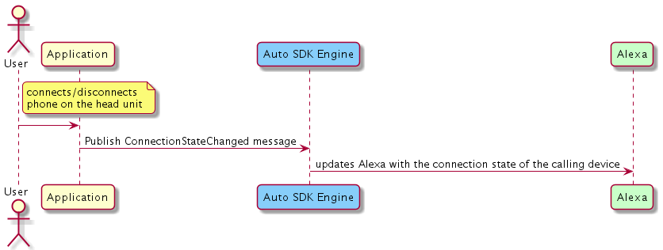
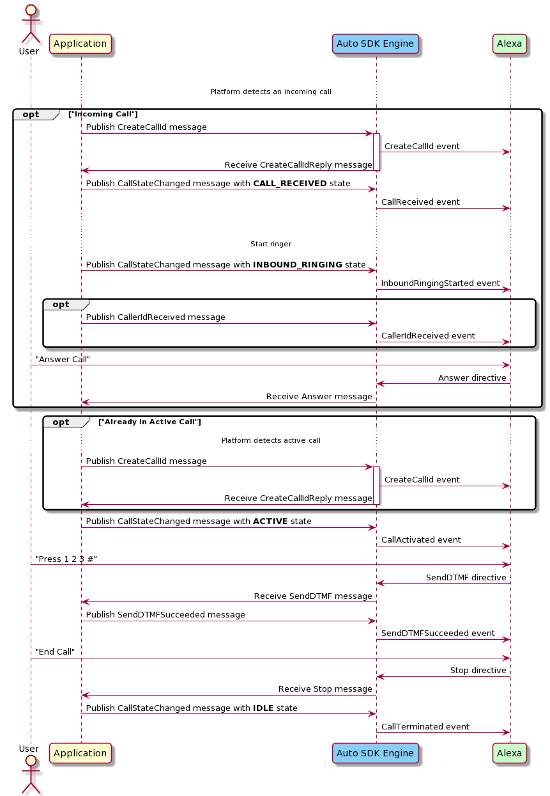
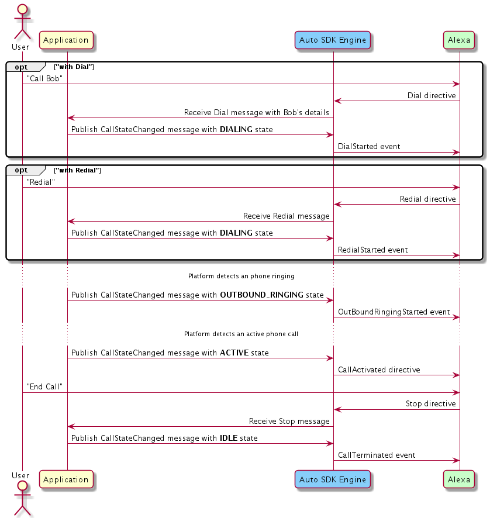

# Phone Control Module

## Overview

The `Phone Control` module enables your Alexa Auto SDK client application to use the phone call control capabilities of Alexa, independent of the connection mechanism to the calling device. By using the `PhoneCallController` interface in your application, you allow the end user to interact with new or ongoing calls using Alexa, and you provide Alexa with the state of the calling device. The `Phone Control` module uses phone contacts uploaded via the `Address Book` module.

Your application's `PhoneCallController` integration is responsible for managing the lifecycle of the call session, including enhancing the end user experience by:

* Preventing Alexa Text To Speech (TTS) from being fed back into the microphone when the user triggers Alexa during a call. To accomplish this, your implementation should stop feeding the microphone input into the call channel until Alexa returns to the idle state, and it should also specify strong echo cancellation.
* Lowering the audio level of previous media in response to an incoming call until the call is answered or declined (if ducking is supported) and pausing the media if the call is answered.
* Maintaining the last dialed number to support redialing.


## Configuring the Phone Control Module

The `Phone Control` module does not require Engine configuration.


## Using the Phone Call Controller AASB Messages

### Changing Connection State

When connection to a calling device is established or terminated, publish the [`ConnectionStateChanged` message](https://alexa.github.io/alexa-auto-sdk/docs/aasb/phone-control/PhoneCallController/index.html#connectionstatechanged).

<details markdown="1"><summary>Click to expand or collapse sequence diagram: Connection State Changed</summary>
<br></br>


</details>

</br>

### Updating Device Configuration

To update the device configuration of the connected calling device, publish the [`DeviceConfigurationUpdated` message](https://alexa.github.io/alexa-auto-sdk/docs/aasb/phone-control/PhoneCallController/index.html#deviceconfigurationupdated).

> **Note:** The Auto SDK only supports updates to `DTMF_SUPPORTED` to enable or disable `SendDTMF`.

<details markdown="1"><summary>Click to expand or collapse sequence diagram: Device Configuration Updated</summary>
<br></br>


</details>

</br>

### Calling

Whether the call is initiated by Alexa or by the user, during the call session your application is responsible for publishing [`CallStateChanged` messages](https://alexa.github.io/alexa-auto-sdk/docs/aasb/phone-control/PhoneCallController/index.html#callstatechanged) to inform the Engine of the progression of the call (e.g., call is answered, call ended) while the Engine publishes messages to the application in order to handle user interactions with the call (e.g., answer, dial, stop).

Regardless of whether the call is inbound or outbound:

* During a call if the user asks Alexa to press the keypad, the Engine publishes the [`SendDTMF` message](https://alexa.github.io/alexa-auto-sdk/docs/aasb/phone-control/PhoneCallController/index.html#senddtmf). Your application must handle this message and publish either the [`SendDTMFSucceeded` message](https://alexa.github.io/alexa-auto-sdk/docs/aasb/phone-control/PhoneCallController/index.html#senddtmfsucceeded) or [`SendDTMFFailed` message](https://alexa.github.io/alexa-auto-sdk/docs/aasb/phone-control/PhoneCallController/index.html#senddtmffailed) to indicate its completion or failure, respectively.
* If an error occurrs during an active call or call setup, publish the [`CallFailed` message](https://alexa.github.io/alexa-auto-sdk/docs/aasb/phone-control/PhoneCallController/index.html#callfailed) specifying the error.
* When the user asks Alexa to hang up a call, cancel a call setup, or decline an incoming call the Engine publishes the [`Stop` message](https://alexa.github.io/alexa-auto-sdk/docs/aasb/phone-control/PhoneCallController/index.html#stop).

---

#### Inbound Calling

When an inbound call is detected, publish the [`CreateCallId` message](https://alexa.github.io/alexa-auto-sdk/docs/aasb/phone-control/PhoneCallController/index.html#createcallid). In response, the Engine will publish the `CreateCallId` reply containing a unique identifier for the call. Once an inbound call alert is received, your application must publish the `CallStateChanged` message indicating the call is now in the **CALL_RECEIVED** state. When the inbound call begins ringing, publish the `CallStateChanged` message, this time specifying the **INBOUND_RINGING** call state.

If the user asks Alexa to answer the inbound call, the Engine publishes the [`Answer` message](https://alexa.github.io/alexa-auto-sdk/docs/aasb/phone-control/PhoneCallController/index.html#answer). Publish the `CallStateChanged` message indicating the call is now **ACTIVE**.

Whenever the user asks Alexa to end the call, the Engine publishes the `Stop` message. Publish the `CallStateChanged` message to indicate that the call is now **IDLE**.

> **Note:** When a caller id is received for an inbound call, publish the [`CallerIdReceived` message](https://alexa.github.io/alexa-auto-sdk/docs/aasb/phone-control/PhoneCallController/index.html#calleridreceived).

<details markdown="1"><summary>Click to expand or collapse sequence diagram: Inbound Calling</summary>
<br></br>


</details>

</br>

#### Outbound Calling

When a user asks Alexa to dial a number or call an uploaded contact, the Engine publishes the [`Dial` message](https://alexa.github.io/alexa-auto-sdk/docs/aasb/phone-control/PhoneCallController/index.html#dial). Alternatively, if the user asks Alexa to redial the last dialed number, the Engine publishes the [`Redial` message](https://alexa.github.io/alexa-auto-sdk/docs/aasb/phone-control/PhoneCallController/index.html#redial). In both cases, your application must publish the `CallStateChanged` message indicating the call is now in the **DIALING** state. Once the outgoing call setup is complete and outbound ringing has started, publish the `CallStateChanged` message specifying the **OUTBOUND_RINGING** call state.

If the call is answered and in progress, publish the `CallStateChanged` message indicating the call is now **ACTIVE**.

Whenever the user asks Alexa to end the call, the Engine publishes the `Stop` message. Publish the `CallStateChanged` message to indicate that the call is now **IDLE**.

> **Note:** It is possible for the connection state to become `DISCONNECTED` after the user asks Alexa to dial or redial a number. Therefore, the application must ensure to check the connection state when the [`Dial`](https://alexa.github.io/alexa-auto-sdk/docs/aasb/phone-control/PhoneCallController/index.html#dial) or [`Redial`](https://alexa.github.io/alexa-auto-sdk/docs/aasb/phone-control/PhoneCallController/index.html#redial) message is received. If the call cannot be placed, publish the [`CallFailed` message](https://alexa.github.io/alexa-auto-sdk/docs/aasb/phone-control/PhoneCallController/index.html#callfailed) specifying an appropriate error code and message.

<details markdown="1"><summary>Click to expand or collapse sequence diagram: Outbound Calling</summary>
<br></br>


</details>

</br>

## Integrating the Phone Call Controller Module Into Your Application

Use the `MessageBroker` to subscribe to and publish `PhoneCallController` AASB messages.

<details markdown="1"><summary>Click to expand or collapse C++ sample code</summary>

```cpp
#include <AACE/Core/MessageBroker.h>

#include <AASB/Message/PhoneCallController/PhoneCallController/CallError.h>
#include <AASB/Message/PhoneCallController/PhoneCallController/CallState.h>
#include <AASB/Message/PhoneCallController/PhoneCallController/CallingDeviceConfigurationProperty.h>
#include <AASB/Message/PhoneCallController/PhoneCallController/ConnectionState.h>
#include <AASB/Message/PhoneCallController/PhoneCallController/DTMFError.h>

#include <AASB/Message/PhoneCallController/PhoneCallController/AnswerMessage.h>
#include <AASB/Message/PhoneCallController/PhoneCallController/CallerIdReceivedMessage.h>
#include <AASB/Message/PhoneCallController/PhoneCallController/CallFailedMessage.h>
#include <AASB/Message/PhoneCallController/PhoneCallController/CallStateChangedMessage.h>
#include <AASB/Message/PhoneCallController/PhoneCallController/ConnectionStateChangedMessage.h>
#include <AASB/Message/PhoneCallController/PhoneCallController/CreateCallIdMessage.h>
#include <AASB/Message/PhoneCallController/PhoneCallController/DeviceConfigurationUpdatedMessage.h>
#include <AASB/Message/PhoneCallController/PhoneCallController/DialMessage.h>
#include <AASB/Message/PhoneCallController/PhoneCallController/RedialMessage.h>
#include <AASB/Message/PhoneCallController/PhoneCallController/SendDTMFMessage.h>
#include <AASB/Message/PhoneCallController/PhoneCallController/SendDTMFFailedMessage.h>
#include <AASB/Message/PhoneCallController/PhoneCallController/SendDTMFSucceededMessage.h>
#include <AASB/Message/PhoneCallController/PhoneCallController/StopMessage.h>

#include <nlohmann/json.hpp>
using json = nlohmann::json;

class MyPhoneCallControllerHandler {

    // Subscribe to messages from the Engine
    void MyPhoneCallControllerHandler::subscribeToAASBMessages() {
    m_messageBroker->subscribe(
        [=](const std::string& message) { handleAnswerMessage(message); },
        AnswerMessage::topic(),
        AnswerMessage::action());
    m_messageBroker->subscribe(
        [=](const std::string& message) { handleDialMessage(message); },
        DialMessage::topic(),
        DialMessage::action());
    m_messageBroker->subscribe(
        [=](const std::string& message) { handleRedialMessage(message); },
        RedialMessage::topic(),
        RedialMessage::action());
    m_messageBroker->subscribe(
        [=](const std::string& message) { handleSendDMTFMessage(message); },
        SendDTMFMessage::topic(),
        SendDTMFMessage::action());
    m_messageBroker->subscribe(
        [=](const std::string& message) { handleStopMessage(message); },
        StopMessage::topic(),
        StopMessage::action());
    m_messageBroker->subscribe(
        [=](const std::string& message) { handleCreateCallIdReplyMessage(message); },
        CreateCallIdMessageReply::topic(),
        CreateCallIdMessageReply::action());
    }

    // Handle the Answer message from the Engine
    void MyPhoneCallControllerHandler::handleAnswerMessage(const std::string& message) {
        AnswerMessage msg = json::parse(message);
        answer(msg.payload.payload);
    }

    // Handle the Dial message from the Engine
    void MyPhoneCallControllerHandler::handleDialMessage(const std::string& message) {
        AnswerMessage msg = json::parse(message);
        std::string payload = msg.payload.payload;
        dial(msg.payload.payload);
    }

    // Handle the Redial message from the Engine
    void MyPhoneCallControllerHandler::handleRedialMessage(const std::string& message) {
        AnswerMessage msg = json::parse(message);
        redial(msg.payload.payload);
    }

    // Handle the SendDTMF message from the Engine
    void MyPhoneCallControllerHandler::handleSendDMTFMessage(const std::string& message) {
        SendDTMFMessage msg = json::parse(message);
        sendDTMF(msg.payload.payload);
    }

    // Handle the Stop message from the Engine
    void MyPhoneCallControllerHandler::handleStopMessage(const std::string& message) {
        StopMessage msg = json::parse(message);
        stop(msg.payload.payload);
    }

    // Handle the CreateCallId reply message from the Engine
    void MyPhoneCallControllerHandler::handleCreateCallIdReplyMessage(const std::string& message) {
        CreateCallIdMessageReply msg = json::parse(message);
        std::string messageId = msg.header.messageDescription.replyToId;
        std::string callId = msg.payload.callId;

        // ...Handle the generated call id...
    }

    // When an error occurrs during an active call or call setup, publish a CallFailed
    // message to the Engine
    void MyPhoneCallControllerHandler::callFailed(
        const std::string& callId,
        CallError code,
        const std::string& message) {
        CallFailedMessage msg;
        msg.payload.callId = callId;
        msg.payload.code = code;
        msg.payload.message = message;
        m_messageBroker->publish(msg.toString());
    }

    // When the call state changes, publish a CallStateChanged message to the Engine
    void MyPhoneCallControllerHandler::callStateChanged(
        CallState state,
        const std::string& callId,
        const std::string& callerId) {
        CallStateChangedMessage msg;
        msg.payload.state = state;
        msg.payload.callId = callId;
        msg.payload.callerId = callerId;
        m_messageBroker->publish(msg.toString());
    }

    // When a caller id is received for an inbound call, publish a CallerIdReceived
    // message to the Engine
    void MyPhoneCallControllerHandler::callerIdReceived(const std::string& callId, const std::string& callerId) {
        CallerIdReceivedMessage msg;
        msg.payload.callId = callId;
        msg.payload.callerId = callerId;
        m_messageBroker->publish(msg.toString());
    }

    // When connection to a calling device is established or broken, publish a
    // ConnectionStateChanged message to the Engine
    void MyPhoneCallControllerHandler::connectionStateChanged(ConnectionState state) {
        ConnectionStateChangedMessage msg;
        msg.payload.state = state;
        m_messageBroker->publish(msg.toString());
    }

    // To generate an identifier for a call, publish a CreateCallId message to the Engine
    std::string MyPhoneCallControllerHandler::createCallId() {
        CreateCallIdMessage msg;
        m_messageBroker->publish(msg.toString());

        // The Engine will send the CreateCallIdReply message
        // Return the unique identifier from reply message payload
    }

    // When a feature of the calling device changes, publish a
    // DeviceConfigurationUpdated message to the Engine
    void MyPhoneCallControllerHandler::deviceConfigurationUpdated(
        std::unordered_map<CallingDeviceConfigurationProperty, bool> configurationMap) {
        json configuration;
        for (auto it: configurationMap) {
            configuration[configurationFeatureToString(it.first)] = it.second;
        }

        DeviceConfigurationUpdatedMessage msg;
        msg.payload.configurationMap = configuration.dump();
        m_messageBroker->publish(msg.toString());
    }

    // When the DTMF signal is delivered, publish a SendDTMFSucceeded message to the Engine
    void MyPhoneCallControllerHandler::sendDTMFSucceeded(const std::string& callId) {
        SendDTMFSucceededMessage msg;
        msg.payload.callId = callId;
        m_messageBroker->publish(msg.toString());
    }

    // When sending the DTMF signal failed, publish a SendDTMFFailed message to the Engine
    void MyPhoneCallControllerHandler::sendDTMFFailed(
        const std::string& callId,
        DTMFError code,
        const std::string& message) {
        SendDTMFFailedMessage msg;
        msg.payload.callId = callId;
        msg.payload.code = code;
        msg.payload.message = message;
        m_messageBroker->publish(msg.toString());
    }

    void MyPhoneCallControllerHandler::answer(const std::string& payload) {
        // Answer the inbound call
    }

    void MyPhoneCallControllerHandler::dial(const std::string& payload) {
        // Initiate an outbound call
    }

    void MyPhoneCallControllerHandler::redial(const std::string& payload) {
        // Initiate an outbound call
    }

    void MyPhoneCallControllerHandler::stop(const std::string& payload) {
        // Stop the call
    }

    void MyPhoneCallControllerHandler::sendDTMF(const std::string& payload) {
        // Send a DTMF signal
    }

    // Implement to convert CallingDeviceConfigurationProperty to string
    std::string MyPhoneCallControllerHandler::configurationFeatureToString(CallingDeviceConfigurationProperty feature);

};

```

</details>
